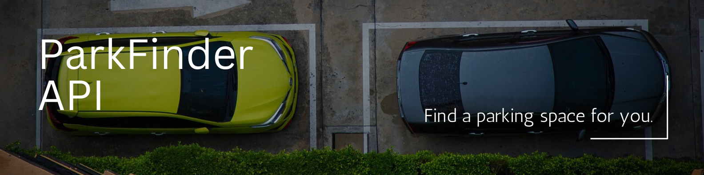

# ParkFind




The ParkFinder addresses the challenge of parking access in urban areas with high population density, as is the case in many cities worldwide. This project aims to optimize the use of private parking spaces that are not permanently in use in residential properties, offering a solution for both the owners of these spaces and users in search of temporary parking.

Furthermore, by leveraging technology to efficiently match available parking spots with demand, ParkFinder streamlines the process of finding parking, reducing congestion, and enhancing the overall urban mobility experience. Additionally, ParkFinder contributes to creating more sustainable cities by minimizing the need for additional infrastructure development and encouraging the shared use of existing resources.

---


ParkFinder's solution directly contributes to achieving United Nations Sustainable Development Goal 11, which aims to make cities more inclusive, safe, resilient, and sustainable. By optimizing the use of existing private parking spaces in densely populated urban areas, ParkFinder promotes inclusivity by providing an accessible and affordable parking alternative for all users, regardless of their economic situation.

Furthermore, by reducing the need for constructing new parking facilities, it contributes to urban sustainability by minimizing carbon footprint and vehicular congestion. Simultaneously, by offering a safe and reliable parking option, ParkFinder enhances urban safety and resilience by reducing the risk of thefts and accidents on the streets, thus fostering a safer environment for all city dwellers.

## Getting started

### Installation

1. Clone the repository to your local machine:

   ```sh
   git clone https://github.com/iamcarlosdaniel/ParkFind
   ```

2. Navigate to the project directory:

   ```sh
   cd ParkFind
   ```

3. Install the necessary dependencies:

   ```sh
   npm install
   ```

4. Start the development server:

   ```sh
   npm run dev
   ```

### Learn more examples

#### Quick Start

Learn how to use our BackEnd, please read the [ParkFinder Quick Start](), which includes API usage examples.

#### Example

A complete example showcasing the implementation on a frontend for users on mobile devices and web, as well as for platform administrators, can be found in the following repositories:

- [Mobile Users Example (Offerors and Applicants)]()
- [Web Users Example (Administrators)]()

## Documentation

Consult the documentation and API descriptions for proper usage.

All the documentation is available in the `/docs` folder, and you can view the index in the [index.md](docs/index.md) file inside that folder in our repository.

## Development Team

ParkFinder would not be possible without you all. We appreciate your help!

#### FrontEnd - Web

📁[Repositorio en GitHub]()

- Bruna Antelo Prado [@usergithub]()
- Luis Enrique Padilla Arandia [@usergithub]()

#### FrontEnd - Movil

📁[Repositorio en GitHub]()

- Telassim Tammy Valentina Lazaro Quispe [@usergithub]()
- Jose Maria Zapata Paz [@usergithub]()

#### BackEnd

📁[Repositorio en GitHub]()

- Carlos Daniel Menchaca Arauz - [@iamcarlosdaniel]()

## License

This project is under the MIT License - Refer to the file [LICENSE.md](LICENSE.md) for more details.
